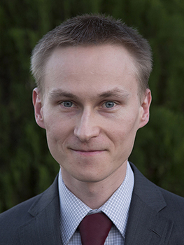

<h3><b>{{ site.username }} </b></h3>
<h4>{{ site.jobtitle }} {{ site.company }}</h4> 

<h3><b><a href="{{ site.cv }}">Curriculum Vitae</a></b></h3>             
<h3><b>Contact</b></h3>
Email: <a href="mailto:{{ site.email }}">{{ site.email }}</a>  
Phone: <a href="tel:1-951-905-0647">(951) 905-0647</a>  
<h3><b>Research fields</b></h3>
Energy and environmental economics, health economics, transportation economics, industrial organization  
<h3><b>Working Papers</b></h3>
<a href="papers/Kokoza_JMP_October2016.pdf">Spatially Differentiated Renewable Energy Subsidies: What Is There to Gain?</a> Job Market Paper 
<h3><b>Publications</b></h3>
<a href="http://dx.doi.org/10.1016/j.ecotra.2016.11.001">Equilibrium traffic dynamics in a bathtub model: A special case</a> Richard Arnott, Anatolii Kokoza and Mehdi Naji. 2016. <b>Economics of Transportation</b>.  

